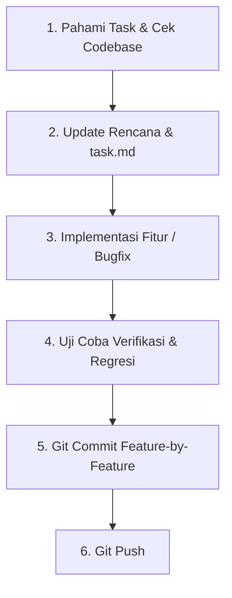

# Prosedur Pengembangan & Alur Kerja Git (Git Workflow & Testing Procedure)

Dokumen ini mendefinisikan langkah standar yang harus diikuti setiap kali mengerjakan suatu fitur atau tugas (task) dalam proyek Prambanan Software House Revamp.

---

## 1. Siklus Pengerjaan Task (Task Lifecycle)

Setiap pengerjaan tugas harus mengikuti tahapan berikut secara disiplin:

### Langkah 1: Pahami Task & Cek Codebase
- Teliti area kode yang terpengaruh.
- Pastikan tidak ada dependensi yang bentrok.

### Langkah 2: Update Rencana & Checklist
- Tambahkan tugas baru ke dalam berkas `task.md` (dan `implementation_plan.md` jika perubahan bersifat struktural).

### Langkah 3: Implementasi
- Tulis kode yang bersih, aman (securing keys, RLS, input validation), responsif, dan performan.

### Langkah 4: Uji Coba Verifikasi & Regresi (Testing)
Sebelum melakukan commit, lakukan rangkaian tes berikut:
1. **Static Analysis & Build Check:**
   - Jalankan `npm run lint` untuk memastikan tidak ada error/warning kode atau React hooks.
   - Jalankan `npm run build` untuk memvalidasi bahwa optimasi halaman Next.js dan dynamic routes berjalan 100% sukses.
2. **Uji Coba Fungsional Fitur Baru:**
   - Jalankan server lokal (`npm run dev`).
   - Uji API endpoint menggunakan `curl` atau visual testing untuk memastikan respon status (`200 OK`, `400 Bad Request`, `429 Too Many Requests`) sesuai harapan.
3. **Uji Coba Regresi Fitur Sebelumnya & Integrasi:**
   - Cek halaman-halaman utama dan alur yang terhubung dengan fitur baru.
   - Pastikan fitur chat widget, form kontak, dan halaman admin tidak mengalami kerusakan akibat perubahan terbaru.

### Langkah 5: Git Commit Feature-by-Feature
- Jangan meng-commit seluruh perubahan besar sekaligus dalam satu commit raksasa (*monolithic commit*).
- Pecah commit menjadi per-fitur/fungsionalitas.
- Gunakan pesan commit yang deskriptif dan standar (misalnya menggunakan gaya *Conventional Commits* seperti `feat:`, `fix:`, `docs:`, `security:`).

### Langkah 6: Git Push
- Push cabang (branch) ke remote repository secara berkala untuk menjaga sinkronisasi.

---

## 2. Standar Commit Per Fitur

Gunakan format commit berikut:
- **`feat(<scope>): <description>`** untuk fitur baru.
- **`fix(<scope>): <description>`** untuk perbaikan bug.
- **`security(<scope>): <description>`** untuk perbaikan celah keamanan (env, RLS, endpoint sanitization).
- **`docs(<scope>): <description>`** untuk perubahan dokumentasi.

*Contoh pemecahan commit:*
1. `security(env): remove NEXT_PUBLIC_ prefixes and add env example`
2. `feat(api): create server-side telegram notify endpoint`
3. `feat(api): create contact submission api using emailjs rest`
4. `feat(admin): protect admin chat with supabase auth portal`
